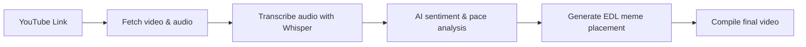

<p align="center">
  
</p>

<h1 align="center">⚡ MemeFlow — Smart Meme Editor</h1>

<p align="center">
  
  
  
  
</p>

<p align="center">
  <b>Drop a YouTube link → get perfectly timed memes injected into the video.<br>Fully automatic. One click.</b>
</p>

---

## 📌 Overview

**MemeFlow** is an open-source AI pipeline that automatically detects the funniest moments in any YouTube video and overlays relevant video/sound memes.  

It downloads the video, transcribes speech to text, analyses the transcript for emotional beats and joke timing, then compiles a new video with the memes perfectly synced. Everything is packed into a lightweight C++ desktop interface.

## ✨ Features

- 🎯 **One‑click operation** – paste a link and press start.
- 🌐 **Runs everywhere** – tested on Windows, Linux and macOS.
- 🧠 **AI‑powered meme selection** – uses Groq (cloud) or a local Gemma model.
- 🖥️ **Tiny native UI** – built with Dear ImGui + GLFW, consumes <30 MB RAM.
- 🚀 **Hardware acceleration** – auto‑detects NVIDIA CUDA, AMD Vulkan, or Intel CPU.
- 🔊 **Whisper‑based transcription** – fast, accurate, time‑coded subtitles.
- 🎬 **Professional FFmpeg compositing** – overlay, adelay, amix with filter_complex.
- 🌍 **Full RTL (Arabic) support** – polished bidirectional text rendering.

## 🧩 How It Works



## 📁 Project Structure

```
meme_flow/
├── install.py                # Smart installer (detects GPU, sets up everything)
├── install.sh                # Linux/macOS entry point
├── install.ps1               # Windows entry point
├── requirements.txt          # Python dependencies
├── config.py                 # Global configuration
├── main.py                   # CLI pipeline runner
├── stages/                   # Four processing stages
│   ├── fetcher.py            # YouTube download via yt-dlp
│   ├── transcriber.py        # Speech-to-text via whisper.cpp
│   ├── analyzer.py           # AI analysis + EDL generation
│   └── compiler.py           # FFmpeg video assembly
├── gui/                      # C++ desktop interface
│   ├── main.cpp              # Main application
│   ├── CMakeLists.txt
│   └── imgui/                # Dear ImGui library
├── utils/
│   └── helpers.py            # Format detection, timing helpers
├── assets/
│   └── memes/                # Place your own meme clips here
└── output/                   # Finished meme‑infused videos
```

## 🚀 Installation

### One‑liner (recommended)

**Linux & macOS**  
```bash
curl -sSL https://raw.githubusercontent.com/USERNAME/meme_flow/main/install.sh | bash
```

**Windows (PowerShell)**  
```powershell
irm https://raw.githubusercontent.com/USERNAME/meme_flow/main/install.ps1 | iex
```

The script automatically:
- Downloads FFmpeg, whisper.cpp, yt-dlp
- Installs Python libraries
- Builds the C++ GUI
- Detects your GPU and configures the fastest backend.

## 🖥️ Usage

1. Launch the application (or run `memeflow` from terminal).
2. Paste a YouTube link into the input field.
3. Click **"ابدأ"** (Start).
4. Watch the progress bar until completion.
5. Click **"تحميل الفيديو"** to save the final meme‑enhanced video.

## 🧠 Device Detection Algorithm

During installation, MemeFlow inspects your hardware:

- **NVIDIA GPU** → CUDA enabled for maximum speed.
- **AMD GPU** (discrete or integrated) → Vulkan (lightweight and fast).
- **Intel iGPU / CPU‑only** → Multi‑core CPU with AVX2/AVX512 fallback.

This guarantees smooth performance on everything from a low‑power laptop to a high‑end workstation.

## ⚙️ Configuration

Edit `config.py` to adjust:

```python
TEMP_DIR = Path("temp")         # Working directory
OUTPUT_DIR = Path("output")     # Final video location
MEMES_DIR = Path("assets/memes")# Your meme collection
WHISPER_MODEL = "base"          # tiny / base / small / medium
ANALYZER_BACKEND = "groq"       # groq or local
GROQ_API_KEY = "sk-xxxx"        # Only needed for cloud AI
```

## 🤝 Contributing

Contributions are welcome! See `CONTRIBUTING.md` for guidelines.

- Open an issue to report bugs or request features.
- Fork, create a branch, and submit a PR.
- Keep the code open and respect the MIT license.

## 📜 License

This project is licensed under the **MIT License** – you are free to use, modify, and distribute it in personal or commercial projects, provided you retain the original copyright notice.

---

<p align="center">
  <i>Made with ❤️ for the open‑source community</i><br>
  <b>MemeFlow – make your videos speak in memes! 🎬</b>
</p>
